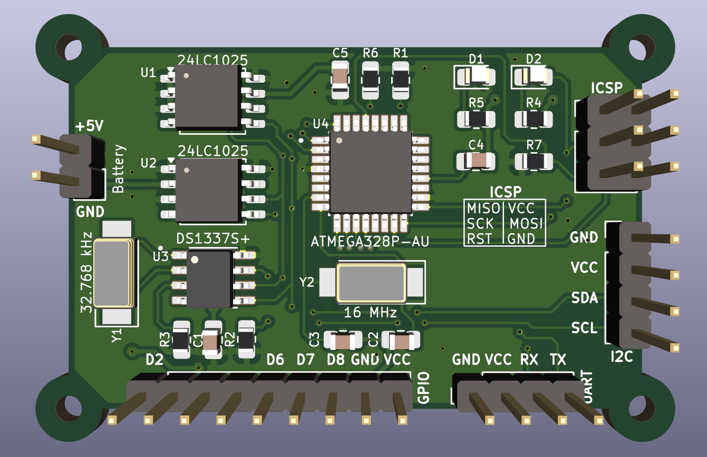

# MCU Data Logger

## Project description
In many embedded systems, there is often a lack of non-volatile or a dedicated mechanism for long-term data logging. Sensor readings, digital signals or communication data are frequently lost or must be transmitted in real time, which can be inconvenient or require constant infrastructure.

To address this limitation, I developed a compact data logger that acts as an independent module capable of storing data for later analysis. The device can capture data from digital or receive custom data frames sent by other devices via a communication bus.

## Project Goals and Scope 
- Design and build a complete embedded data-logging system including hardware, firmware and mechanical design.
- Capture data from digital inputs or communication frames transmitted over a bus.
- Store data safely in non-volatile memory (using internal CPU EEPROM or two external I2C chips).
- Provide a user interface for operation control and system status.
- Include a custom 3D-printed enclosure to protect the electronics and ensure ease of installation.

## Hardware design
The hardware is build around an ATmega328p microcontroller running with an external 16MHz crystal oscillator, ensuring stable and precise timing for all operations.
Data may be stored in two external 24LC1025 I2C EEPROM chips, which provide a large amount of non-volatile memory for long-term data logging. An additional DS1337S+ RTC module keeps accurate time for timestamping logged events.

The board includes two LEDs: one serves as a power indicator, while the second is user-programmable and can be freely controlled by the firmware for signaling various system states.
External connection are provided for 5 V power input, six digital inputs and accompanying +5 V and GND rails for convenient sensor or signal wiring. Communication and programming interfaces are also available through UART, I2C and SPI/ICSP headers.

The PCB has been designed with mechanical integration in mind.
It can be easily mounted inside the custom 3D-printed enclosure, with precisely aligned M2 mounting holes and standoff positions that provide a secure fit between the base and the upper part of the case.

*3D render of the PCB board made in KiCad software*

---

*Finished PCB board*

---

*PCB board with bottom part of the enclosure*

---

*Assembled device*

---

## Example Application - Office Window Monitor
To demonstrate the flexibility of the MCU Data Logger platform, a sample firmware project project was implemented for monitoring office windows.

The system uses six magnetic reed switches (contact sensors) connected to the digital inputs of the board. It continuously monitors each window's state, counts the number of openings and calculates the total time each window remains open.

### Communication Interface (UART)
The device communicates with a PC via UART, accepting three command codes:
- '1' - Sends the current window states , total number of openings and total open time for each channel.
- '2' - Resets all data stored in EEPROM and RAM.
- '3' - Prints the system uptime since power-on.

This allows the user to easily monitor and control the logger from a serial console or custom PC software.

### Firmware structure
The firmware was written entirely in C and designed to be modular, reusable and easy to extend for different data-logging applications. 
It is divided into two layers: a set of core low-level drivers and an application layer implementing the example project logic.

#### Core drivers
These modules provide essential hardware functionality and can be reused across multiple projects built on this platform:
- **i2c.c / i2c.h** - Communication with external 24LC1025 EEPROMs and the DS1337S+ RTC module via I2C bus
- **uart.c / uart.h** - UART serial interface for communication with a PC or other microcontrollers
- **eeprom.c / eeprom.h** - Management of non-volatile internal data storage
- **rtc.c / rtc.h** - Real-time clock driver providing precise timekeeping and timestamps

#### Application layer
This section implements the Office Window Monitor example, showcasing how the data logger can be adapted to real-world tasks:
- **windows.c / windows.h** - Detects window openings, counts events and measures how long each window remains open.
- **console.c / console.h** - handles UART command parsing and formatted data output for the serial console.

### Example UART Output

After startup, the device displays basic information such as firmware version, UART settings and available commands.
The first readout shows the initial state where all windows are closed.
After a short time, another read reveals that window 2 and 6 have been opened several times, with their total open duration displayed.
Next, the system uptime is requested and shown as 00:00:43.
Finally, the reset command is issued, clearing all stored data - the last read confirms that all counters and timers have returned to zero.

## Reusability and Development Notes
- The device operates from a 5 V power supply, which can be provided through the main power connector on the left side of the board or directly from the ICSP header during programming or testing.
- Firmware is programmed via the ICSP interface, and in this project the board was flashed using a USBasp HW-437 programmer.
- For serial communication and debugging, a USB-UART converter (FT232) was used to connect the logger to a PC terminal.

## Author
- Name: Krzysztof Tomicki
- Contact: [tomicki.krzysztof.pv@gmail.com](mailto:tomicki.krzysztof.pv@gmail.com)
